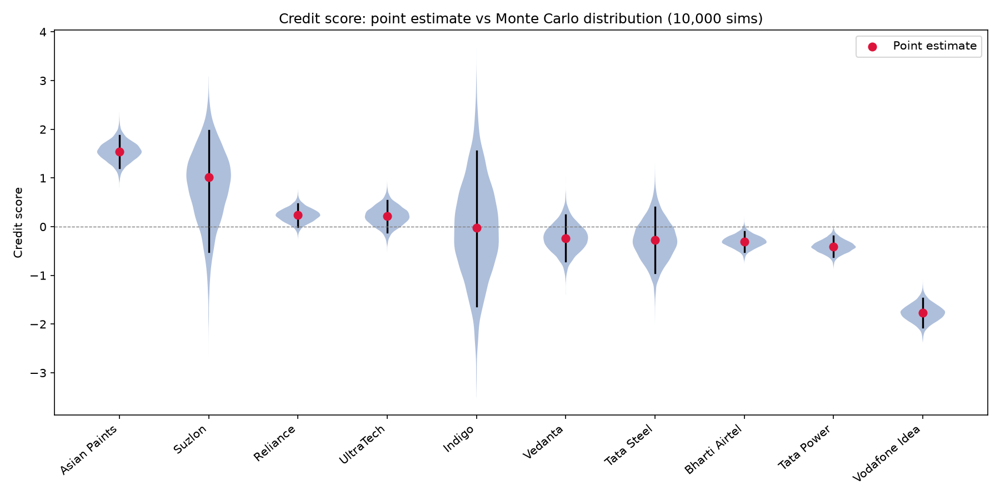
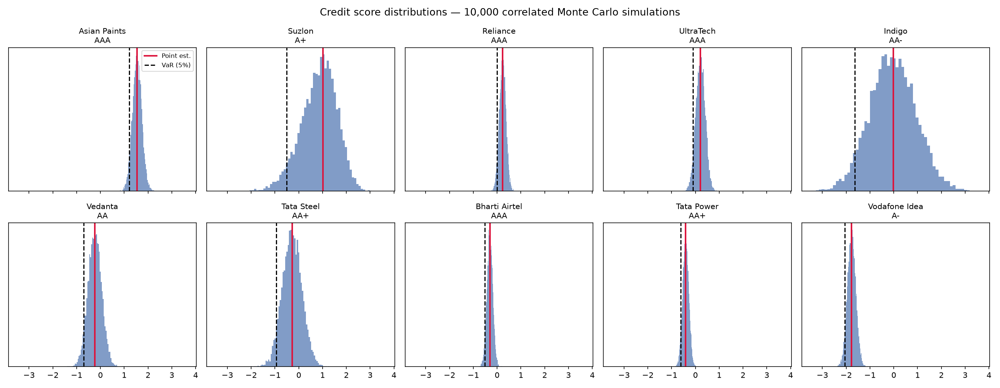
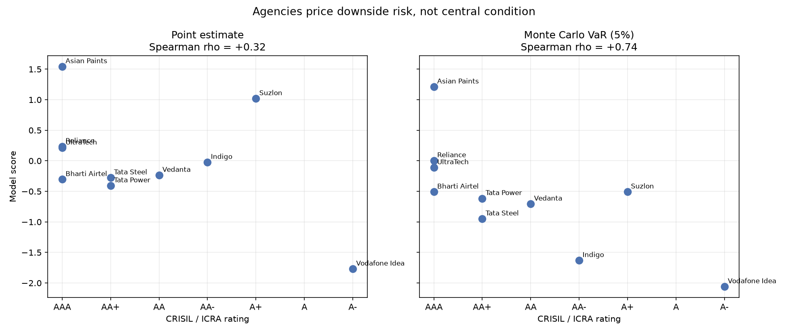
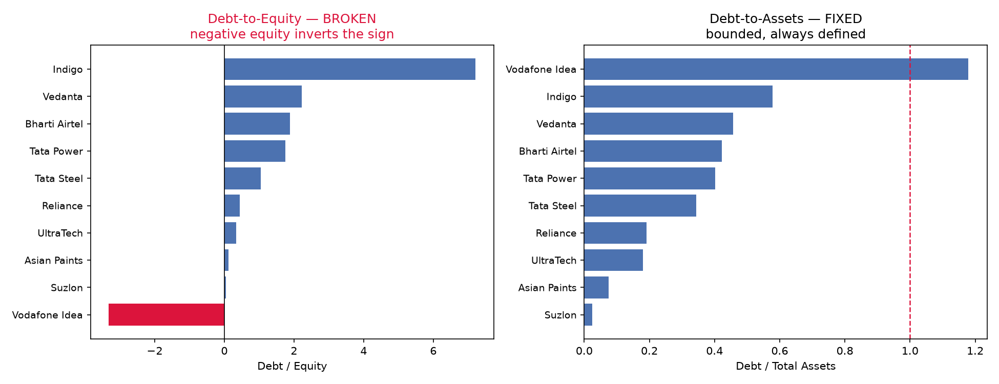
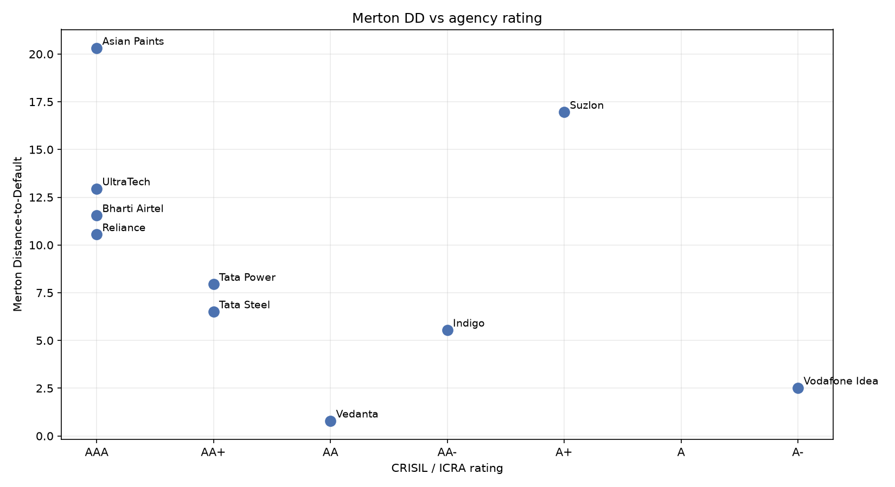

# Corporate Credit Risk Analysis: Ratio Scoring, Monte Carlo & Merton Models

Two independent credit risk models applied to 10 rated Indian corporates (FY2021–2025), each validated against actual CRISIL / ICRA ratings. One model is built from accounting ratios, the other from market data. The aim is not to reproduce agency ratings, but to measure how closely a transparent, rule-based model tracks them, and to understand where and why the two diverge.

**Main result.** Ranking firms by their simulated downside risk (Value-at-Risk) matched the agency ratings far more closely than ranking by their central score. Spearman rank correlation rose from 0.32 to 0.74, which points to agencies weighting worst-case risk more heavily than average financial condition.

## Dataset

Ten non-financial, publicly rated Indian firms spanning the credit spectrum from AAA to A−, each with five years of financials and a domestic long-term rating.

| Rating | Firms |
|--------|-------|
| AAA | Reliance, UltraTech, Asian Paints, Bharti Airtel |
| AA+ | Tata Steel, Tata Power |
| AA | Vedanta |
| AA− | IndiGo |
| A+ | Suzlon |
| A− | Vodafone Idea |

Four ratios per firm-year: leverage (debt-to-assets), interest coverage, liquidity (current ratio), and profitability (ROCE).

## Method

**Scoring :** Each ratio is normalised to a z-score, direction-aligned so that higher always means safer, then weighted and summed. Leverage and coverage carry 30% each, liquidity and profitability 20% each. Interest coverage is log-transformed first to control its heavy right skew.

**Monte Carlo :** Each firm's single score is expanded into a distribution of 10,000 scenarios. Ratios are simulated jointly using a pooled correlation matrix and Cholesky decomposition, which preserves their real dependencies — interest coverage and ROCE correlate at 0.88, since both derive from operating profit. Distributions are centred on the latest year and scaled by five-year volatility.

**Risk metrics :** Value-at-Risk (5th percentile) and Conditional VaR (Expected Shortfall) are computed per firm from the simulated distributions.

**Validation :** Model rankings are tested against the actual agency ratings using Spearman rank correlation.

**Merton model :** A second, market-based model treats equity as a call option on the firm's assets. Using market capitalisation and equity volatility from daily prices, it solves for asset value and asset volatility, then derives a distance-to-default and a probability of default.

## Key Findings

**Agencies rank by downside, not central condition.** Point-estimate and Monte Carlo mean scores both correlated with ratings at 0.32 (not significant). Ranking by 5th-percentile VaR lifted this to 0.74 (p = 0.014). The model and data were identical; only the ranking metric changed. Average rank disagreement with the agencies fell from 2.9 to 1.7 positions.

**A standard leverage metric fails on distressed firms.** Debt-to-equity is undefined as equity approaches zero and inverts sign when equity turns negative. It affected two firms and would have ranked Vodafone Idea, which cannot cover its interest, as the safest name in the set. Debt-to-assets, which is bounded and always defined, replaced it. The original ratio is retained in the dataset as documented evidence of the failure.

**Divergences are informative and symmetric.** The model is too optimistic on Suzlon and too pessimistic on Bharti Airtel. Suzlon looks strong on current ratios (debt-free, high returns), but the agencies still weigh its past default, which ratios cannot see. Airtel carries high leverage that the model penalises, but its contractual telecom cash flows sustain it — again invisible to ratios. Same root cause, opposite directions: ratios capture current condition, ratings capture durable creditworthiness.

**Merton resolves the firms where accounting broke.** Vodafone Idea has book equity of −₹70,320 crore, which broke debt-to-equity, yet its Merton distance-to-default is a finite 2.52 — because market equity retains option value even when a firm is book-insolvent. Merton also flags Vedanta as its riskiest name (PD 21.6%), driven by its 111% equity volatility, a risk that both the ratio model and the agency rating understate.

## Limitations

- **Sample size.** Ten firms is small; the Spearman correlation carries wide confidence intervals, though the reported p-value accounts for this.
- **Single-year scoring.** Firms are scored on FY2025 to align with current ratings. The five-year history feeds the simulation's spread, not the score itself.
- **Normality.** Ratios are simulated as Gaussian, while real financial ratios have fatter tails.
- **Pooled correlation.** A single correlation matrix is estimated across firms, assuming a shared co-movement structure.
- **Merton on investment-grade names.** Absolute default probabilities collapse toward zero for the safest firms (the credit-spread puzzle, a known structural-model limitation), so validation relies on the distance-to-default ranking rather than PD levels.

## Tools

Python · pandas · NumPy · SciPy · Matplotlib · yfinance

## Data Sources

screener.in (financial statements)
trendlyne.com (liquidity ratios) 
CRISIL / ICRA (credit ratings) 
Yahoo Finance (daily prices)
